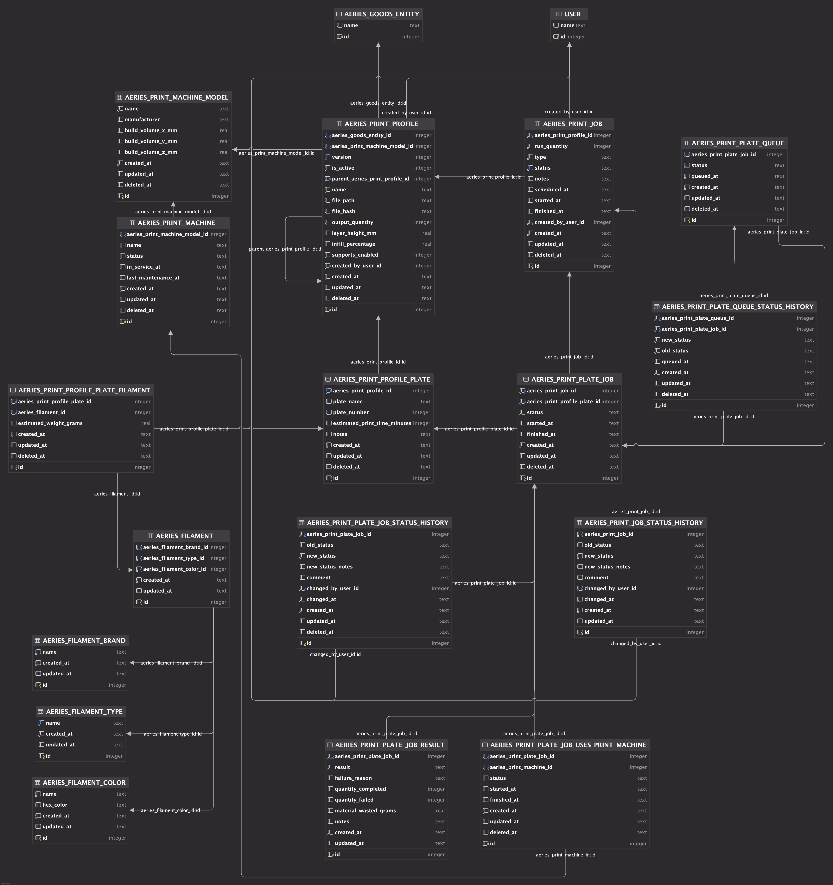

# Database Entity Relationship Explanation

This document provides a detailed explanation of the entities and relationships defined in the Aeries database schema (ERD).

## Overview
The database is designed to manage 3D printing workflows, including print profiles, hardware (machines), material tracking (filaments), and job 
execution (print jobs).

There are 2 tables that should already be predefined: `AERIES_GOODS_ENTITY` and `USERS`. These tables are essential for tracking goods and user 
information, respectively. These will be reverenced within and are free to use in any way to be desired. I my context they are used for the first line
of information in the database. They are not to be deleted but may be modified.

_The 2 tables reverenced (`AERIES_GOODS_ENTITY` and `USERS`) and other/new tables that are made should be included within the next version_

---

## Diagram

---

## Core Entities

The database is structured around several key functional areas.

### 1. Print Profiles & Configuration
- **AERIES_PRINT_PROFILE**: The central entity representing a sliced 3D model configuration.
- **AERIES_PRINT_PROFILE_PLATE**: Defines individual build plates within a print profile.
- **AERIES_PRINT_PROFILE_PLATE_FILAMENT**: Maps filaments to specific plates.

### 2. Materials & Hardware
- **AERIES_FILAMENT**: Represents a specific spool or type of filament.
- **AERIES_FILAMENT_BRAND**: Manufacturers/brands of filament.
- **AERIES_FILAMENT_TYPE**: Material types (e.g., PLA, PETG, ABS).
- **AERIES_FILAMENT_COLOR**: Color definitions for filaments.
- **AERIES_PRINT_MACHINE_MODEL**: Specifications of 3D printer models.
- **AERIES_PRINT_MACHINE**: Physical 3D printer instances.

### 3. Print Jobs & Execution
- **AERIES_PRINT_JOB**: An instance of a print request.
- **AERIES_PRINT_PLATE_JOB**: An instance of a specific plate being printed as part of a job.
- **AERIES_PRINT_PLATE_JOB_RESULT**: Outcome records for completed or failed plate jobs.
- **AERIES_PRINT_JOB_STATUS_HISTORY**: Audit log for main job status transitions.
- **AERIES_PRINT_PLATE_JOB_STATUS_HISTORY**: Audit log for plate job status transitions.
- **AERIES_PRINT_PLATE_JOB_USES_PRINT_MACHINE**: Mapping of plate jobs to the machines they ran on.
- **AERIES_PRINT_PLATE_QUEUE**: Priority management for pending plate prints.
- **AERIES_PRINT_PLATE_QUEUE_STATUS_HISTORY**: Audit log for plate queue status transitions.

---

## Detailed Table Definitions

### AERIES_PRINT_PROFILE
The central configuration for a 3D print. It stores the settings used when slicing a model.

| Field | Type | Description |
| :--- | :--- | :--- |
| `id` | PK | Unique identifier. |
| `aeries_goods_entity_id` | FK | Link to the associated goods entity (the physical product). |
| `aeries_print_machine_model_id` | FK | The machine model this profile is sliced for. |
| `version` | Integer | Version number of the profile. |
| `is_active` | Boolean | Whether this profile is currently available for use. |
| `parent_aeries_print_profile_id` | FK | Reference to a previous version (for version history). |
| `name` | String | Descriptive name of the profile. |
| `file_path` | String | Path to the G-code or project file. |
| `file_hash` | String | Hash of the file to verify integrity. |
| `output_quantity` | Integer | Number of items produced per print. |
| `layer_height_mm` | Decimal | The thickness of each layer in millimeters. |
| `infill_percentage` | Integer | The density of the internal structure (0-100%). |
| `supports_enabled` | Boolean | Whether support structures are required. |
| `created_by_user_id` | FK | User who created the profile. |
| `created_at` | Timestamp | Creation time. |
| `updated_at` | Timestamp | Last update time. |
| `deleted_at` | Timestamp | Soft delete timestamp. |

### AERIES_PRINT_PROFILE_PLATE
A print profile can consist of multiple build plates (e.g., for large assemblies).

| Field | Type | Description |
| :--- | :--- | :--- |
| `id` | PK | Unique identifier. |
| `aeries_print_profile_id` | FK | The parent print profile. |
| `plate_name` | String | Name of the plate (e.g., "Top Cover"). |
| `plate_number` | Integer | Sequential number of the plate within the profile. |
| `estimated_print_time_minutes` | Integer | Predicted duration of the print. |
| `notes` | Text | Additional information about this plate. |
| `created_at` | Timestamp | Creation time. |
| `updated_at` | Timestamp | Last update time. |
| `deleted_at` | Timestamp | Soft delete timestamp. |

### AERIES_PRINT_PROFILE_PLATE_FILAMENT
Defines which filaments (and how much) are used for a specific plate.

| Field | Type | Description |
| :--- | :--- | :--- |
| `id` | PK | Unique identifier. |
| `aeries_print_profile_plate_id` | FK | The specific plate. |
| `aeries_filament_id` | FK | The filament used. |
| `estimated_weight_grams` | Decimal | Predicted weight of material used. |
| `created_at` | Timestamp | Creation time. |
| `updated_at` | Timestamp | Last update time. |
| `deleted_at` | Timestamp | Soft delete timestamp. |

### AERIES_FILAMENT
Represents a physical spool of filament or a specific material SKU.

| Field | Type | Description |
| :--- | :--- | :--- |
| `id` | PK | Unique identifier. |
| `aeries_filament_brand_id` | FK | Reference to the brand. |
| `aeries_filament_type_id` | FK | Reference to the material type (PLA, etc.). |
| `aeries_filament_color_id` | FK | Reference to the color. |
| `created_at` | Timestamp | Creation time. |
| `updated_at` | Timestamp | Last update time. |

### AERIES_FILAMENT_BRAND / TYPE / COLOR
Simple lookup tables for filament properties.
- **Brand**: `id`, `name`, `created_at`, `updated_at`.
- **Type**: `id`, `name`, `created_at`, `updated_at`.
- **Color**: `id`, `name`, `hex_color`, `created_at`, `updated_at`.

### AERIES_PRINT_MACHINE_MODEL
Technical specifications for a line of 3D printers.

| Field | Type | Description |
| :--- | :--- | :--- |
| `id` | PK | Unique identifier. |
| `name` | String | Model name (e.g., "Ender 3"). |
| `manufacturer` | String | Company that made the printer. |
| `build_volume_x_mm` | Decimal | Build width. |
| `build_volume_y_mm` | Decimal | Build depth. |
| `build_volume_z_mm` | Decimal | Build height. |
| `created_at` | Timestamp | Creation time. |
| `updated_at` | Timestamp | Last update time. |
| `deleted_at` | Timestamp | Soft delete timestamp. |

### AERIES_PRINT_MACHINE
A specific, physical machine in the workshop.

| Field | Type | Description |
| :--- | :--- | :--- |
| `id` | PK | Unique identifier. |
| `aeries_print_machine_model_id` | FK | The model of this machine. |
| `name` | String | Friendly name (e.g., "Printer 01"). |
| `status` | Enum | Current state (see Enums section). |
| `in_service_at` | Timestamp | When the machine was added to the workshop. |
| `last_maintenance_at` | Timestamp | Date of last maintenance. |
| `created_at` | Timestamp | Creation time. |
| `updated_at` | Timestamp | Last update time. |
| `deleted_at` | Timestamp | Soft delete timestamp. |

### AERIES_PRINT_JOB
A request to print a specific profile.

| Field | Type | Description |
| :--- | :--- | :--- |
| `id` | PK | Unique identifier. |
| `aeries_print_profile_id` | FK | The profile to be printed. |
| `run_quantity` | Integer | Number of times to run the profile. |
| `type` | Enum | Purpose (Request, Stock Refill, etc.). |
| `status` | Enum | Lifecycle state (see Enums section). |
| `notes` | Text | User notes. |
| `created_by_user_id` | FK | User who initiated the job. |
| `created_at` | Timestamp | Creation time. |
| `updated_at` | Timestamp | Last update time. |
| `deleted_at` | Timestamp | Soft delete timestamp. |
| `scheduled_at` | Timestamp | Planned start time. |
| `started_at` | Timestamp | Actual start time. |
| `finished_at` | Timestamp | Completion or failure time. |

### AERIES_PRINT_PLATE_JOB
Execution of a specific plate within a job.

| Field | Type | Description |
| :--- | :--- | :--- |
| `id` | PK | Unique identifier. |
| `aeries_print_job_id` | FK | Associated main print job. |
| `aeries_print_profile_plate_id` | FK | The plate being printed. |
| `status` | Enum | Lifecycle state (see Enums section). |
| `started_at` | Timestamp | Actual start time. |
| `finished_at` | Timestamp | Completion or failure time. |
| `created_at` | Timestamp | Creation time. |
| `updated_at` | Timestamp | Last update time. |
| `deleted_at` | Timestamp | Soft delete timestamp. |

### AERIES_PRINT_PLATE_JOB_RESULT
Post-job data collection for a specific plate job.

| Field | Type | Description |
| :--- | :--- | :--- |
| `id` | PK | Unique identifier. |
| `aeries_print_plate_job_id` | FK | Associated plate job. |
| `result` | Enum | Final outcome (Success, Failed, Canceled). |
| `failure_reason` | Text | Explanation of failure. |
| `quantity_completed` | Integer | Number of successful units. |
| `quantity_failed` | Integer | Number of failed units. |
| `material_wasted_grams` | Decimal | Amount of material lost to failure. |
| `notes` | Text | Post-mortem notes. |
| `created_at` | Timestamp | Record creation time. |
| `updated_at` | Timestamp | Last update time. |

### AERIES_PRINT_JOB_STATUS_HISTORY
Audit trail of main job status changes.

| Field | Type | Description |
| :--- | :--- | :--- |
| `id` | PK | Unique identifier. |
| `aeries_print_job_id` | FK | Associated job. |
| `old_status` | Enum | Status before change. |
| `new_status` | Enum | Status after change. |
| `new_status_notes` | Text | Reason for change. |
| `comment` | Text | Optional comment. |
| `changed_by_user_id` | FK | User who changed the status. |
| `changed_at` | Timestamp | Time of change. |
| `created_at` | Timestamp | Record creation time. |
| `updated_at` | Timestamp | Last update time. |

### AERIES_PRINT_PLATE_JOB_STATUS_HISTORY
Audit trail of plate job status transitions.

| Field | Type | Description |
| :--- | :--- | :--- |
| `id` | PK | Unique identifier. |
| `aeries_print_plate_job_id` | FK | Associated plate job. |
| `old_status` | Enum | Status before change. |
| `new_status` | Enum | Status after change. |
| `new_status_notes` | Text | Reason for change. |
| `comment` | Text | Optional comment. |
| `changed_by_user_id` | FK | User who changed the status. |
| `changed_at` | Timestamp | Time of change. |
| `created_at` | Timestamp | Record creation time. |
| `updated_at` | Timestamp | Last update time. |
| `deleted_at` | Timestamp | Soft delete timestamp. |

### AERIES_PRINT_PLATE_JOB_USES_PRINT_MACHINE
The junction between plate jobs and the machines that executed them.

| Field | Type | Description |
| :--- | :--- | :--- |
| `id` | PK | Unique identifier. |
| `aeries_print_plate_job_id` | FK | Associated plate job. |
| `aeries_print_machine_id` | FK | Machine used. |
| `status` | Enum | State of the machine for this job. |
| `started_at` | Timestamp | Start time on this machine. |
| `finished_at` | Timestamp | Finish time on this machine. |
| `created_at` | Timestamp | Record creation time. |
| `updated_at` | Timestamp | Last update time. |
| `deleted_at` | Timestamp | Soft delete timestamp. |

### AERIES_PRINT_PLATE_QUEUE
The active queue of plates waiting for execution.

| Field | Type | Description |
| :--- | :--- | :--- |
| `id` | PK | Unique identifier. |
| `aeries_print_plate_job_id` | FK | Associated plate job (Unique). |
| `status` | Enum | Queue status (Waiting, Printing, etc.). |
| `queued_at` | Timestamp | When it entered the queue. |
| `created_at` | Timestamp | Record creation time. |
| `updated_at` | Timestamp | Last update time. |
| `deleted_at` | Timestamp | Soft delete timestamp. |

### AERIES_PRINT_PLATE_QUEUE_STATUS_HISTORY
Audit trail of plate queue status changes.

| Field | Type | Description |
| :--- | :--- | :--- |
| `id` | PK | Unique identifier. |
| `aeries_print_plate_queue_id` | FK | Associated queue entry. |
| `aeries_print_plate_job_id` | FK | Associated plate job. |
| `new_status` | Enum | Status after change. |
| `old_status` | Enum | Status before change. |
| `queued_at` | Timestamp | Time of queuing. |
| `created_at` | Timestamp | Record creation time. |
| `updated_at` | Timestamp | Last update time. |
| `deleted_at` | Timestamp | Soft delete timestamp. |

---

## Relationships Summary

| From Entity | To Entity | Relationship Type | Description |
| :--- | :--- | :--- | :--- |
| `AERIES_PRINT_PROFILE` | `AERIES_GOODS_ENTITY` | Many-to-One | Links a print profile to a generic goods entity. |
| `AERIES_PRINT_PROFILE` | `AERIES_PRINT_MACHINE_MODEL` | Many-to-One | A profile is optimized for a specific machine model. |
| `AERIES_PRINT_PROFILE_PLATE` | `AERIES_PRINT_PROFILE` | Many-to-One | Plates belong to a specific profile. |
| `AERIES_PRINT_JOB` | `AERIES_PRINT_PROFILE` | Many-to-One | A job executes a specific print profile. |
| `AERIES_PRINT_PLATE_JOB` | `AERIES_PRINT_JOB` | Many-to-One | A plate job belongs to a main print job. |
| `AERIES_PRINT_PLATE_JOB` | `AERIES_PRINT_PROFILE_PLATE` | Many-to-One | A plate job executes a specific plate from the profile. |
| `AERIES_PRINT_PLATE_JOB_RESULT` | `AERIES_PRINT_PLATE_JOB` | Many-to-One | Records the outcome of a plate job. |
| `AERIES_PRINT_PLATE_JOB_USES_PRINT_MACHINE` | `AERIES_PRINT_PLATE_JOB` | Many-to-One | Links a plate job to the machine used. |
| `AERIES_PRINT_PLATE_QUEUE` | `AERIES_PRINT_PLATE_JOB` | One-to-One | A queue entry corresponds to a plate job. |
| `AERIES_PRINT_MACHINE` | `AERIES_PRINT_MACHINE_MODEL` | Many-to-One | A physical machine is an instance of a model. |

---

## Enums & Statuses

### Print Job Type (AERIES_PRINT_JOB)
*   `request`: Priority 1, Custom requested print
*   `stock_refill`: Priority 2, To refill empty stock (of new product stock)
*   `decorative`: Priority 3, Decorative printing
*   `testing`: Priority 4, Testing / R&D
*   `Personal`: Priority 5, Personal use

### Print Job Status (AERIES_PRINT_JOB & AERIES_PRINT_PLATE_JOB)
*   `draft`: Job is being prepared.
*   `queued`: Job is ready and waiting for an available machine.
*   `printing`: Job is currently active on a machine.
*   `paused`: Execution is temporarily halted.
*   `completed`: Job finished successfully.
*   `failed`: Job encountered an error.
*   `canceled`: Job was stopped by a user.

### Plate Queue Status (AERIES_PRINT_PLATE_QUEUE)
*   `waiting`: Plate is in the queue, waiting for assignment.
*   `printing`: Plate is currently being printed.
*   `paused`: Printing has been temporarily suspended.
*   `completed`: Printing has been completed
*   `removed`: Plate has been removed from the queue without completion.

### Machine Status
*   `idle`, `printing`, `maintenance`, `offline`.
